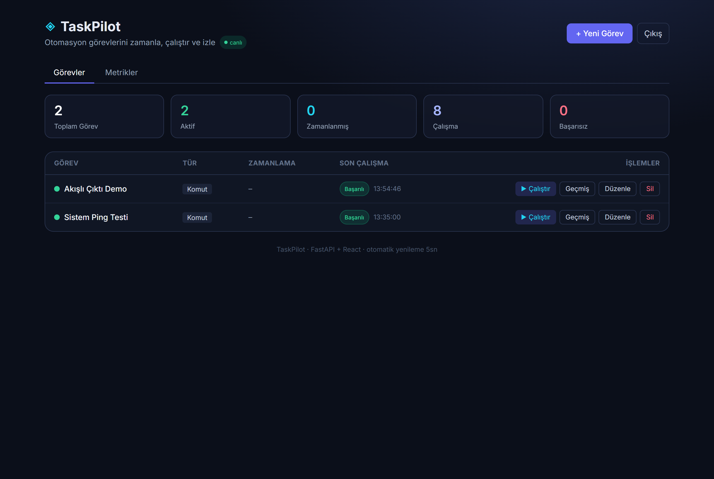
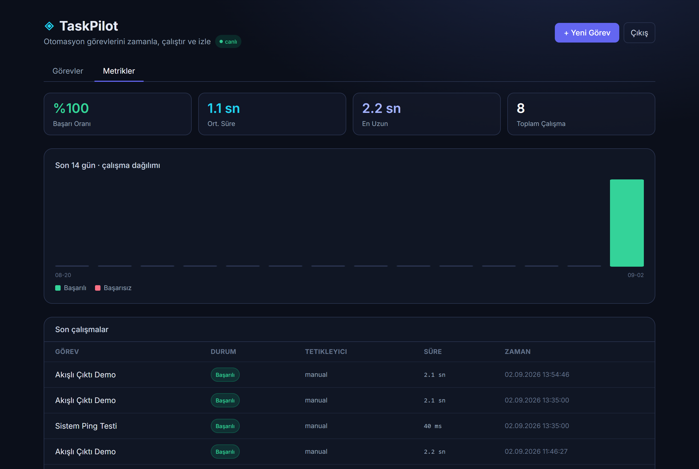
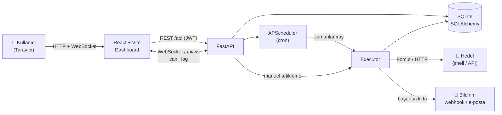

# ◈ TaskPilot

> Zamanlanmış otomasyon görevlerini **oluştur, çalıştır ve izle** — modern bir full-stack pano.

TaskPilot; komut veya HTTP tabanlı görevleri cron ifadeleriyle zamanlayan, manuel tetiklemeye izin veren ve her çalışmanın çıktısını/durumunu kaydeden self-hosted bir otomasyon panosudur. **FastAPI** backend + **React (TypeScript)** frontend ile geliştirilmiştir.

[](https://github.com/ufukguzel/taskpilot/actions/workflows/ci.yml)


---

## 📸 Ekran Görüntüleri

| Pano (Görevler) | Metrikler & Grafikler |
|---|---|
|  |  |

## ✨ Özellikler

- 🔐 **JWT kimlik doğrulama** — login ekranı, korumalı API & WebSocket, oturum yönetimi
- 🗂️ **Görev yönetimi** — komut (`shell`) veya HTTP isteği tipinde görev oluştur/düzenle/sil
- ⏰ **Cron zamanlama** — `*/5 * * * *` gibi ifadelerle otomatik çalıştırma (APScheduler)
- ▶️ **Manuel tetikleme** — herhangi bir görevi anında "Çalıştır"
- 🔴 **Canlı log akışı** — WebSocket ile çalışan görevin çıktısı satır satır anlık akar
- 🔔 **Başarısızlık bildirimi** — görev başarısız olunca webhook (Slack/Discord/özel) ve/veya SMTP e-posta
- 📜 **Çalışma geçmişi & log** — her çalışmanın durumu, tetikleyicisi ve tam çıktısı
- 📊 **Canlı istatistikler** — toplam/aktif/zamanlanmış görev, çalışma & hata sayıları (5 sn'de bir otomatik yenileme)
- 📈 **Metrikler & grafikler** — başarı oranı, ortalama/en uzun süre, son 14 günün çalışma dağılımı (SVG grafik) ve son çalışmalar
- 🔌 **Tek origin dev** — Vite proxy ile `/api` istekleri backend'e yönlenir; CORS derdi yok
- ✅ **Testli** — FastAPI `TestClient` ile API testleri

## 🏗️ Mimari



```
taskpilot/
├── backend/                 # FastAPI + SQLAlchemy + APScheduler
│   ├── app/
│   │   ├── main.py          # Uygulama + lifespan (DB init, seed, scheduler)
│   │   ├── models.py        # User, Task, TaskRun (ORM)
│   │   ├── schemas.py       # Pydantic doğrulama
│   │   ├── crud.py          # Veri erişimi + metrik hesaplama
│   │   ├── auth.py          # JWT + parola hash + bağımlılıklar
│   │   ├── executor.py      # Komut/HTTP çalıştırma (canlı yayınlı)
│   │   ├── scheduler.py     # Cron job yönetimi
│   │   ├── events.py        # WebSocket ConnectionManager
│   │   ├── notifications.py # Webhook + SMTP bildirim
│   │   ├── seed.py          # Varsayılan admin
│   │   └── routers/         # auth, tasks, stats(+metrics), ws
│   ├── Dockerfile
│   └── tests/               # pytest
├── frontend/                # React + Vite + TypeScript + Tailwind
│   ├── src/
│   │   ├── api.ts           # Tip güvenli API istemcisi + token yönetimi
│   │   ├── App.tsx          # Pano (Görevler / Metrikler sekmeleri)
│   │   ├── hooks/           # useLiveRuns (WebSocket)
│   │   └── components/      # Login, TaskForm, LiveConsole, MetricsView, BarChart…
│   ├── Dockerfile
│   └── nginx.conf
├── .github/workflows/ci.yml # CI: pytest + build
└── docker-compose.yml
```

## 🚀 Kurulum

### 1) Backend (FastAPI)

```bash
cd backend
python -m venv .venv
# Windows:
.venv\Scripts\activate
# macOS/Linux:
source .venv/bin/activate

pip install -r requirements.txt
uvicorn app.main:app --reload --port 8000
```

API `http://localhost:8000` · Swagger dokümanı `http://localhost:8000/docs`

İlk açılışta varsayılan bir admin oluşturulur: **`admin` / `admin123`** (üretimde `.env` ile `ADMIN_PASSWORD` ve `SECRET_KEY` değiştir). Ayarlar için `backend/.env.example` dosyasına bak.

### 2) Frontend (React)

```bash
cd frontend
npm install
npm run dev
```

Pano `http://localhost:5173` adresinde açılır (istekler backend'e proxy'lenir).

### 🐳 Docker Compose ile (tek komut)

Backend + frontend'i tek komutla ayağa kaldır:

```bash
docker compose up --build
```

Pano `http://localhost:8080` adresinde açılır (nginx, `/api` ve WebSocket isteklerini backend'e proxy'ler; SQLite verisi `taskpilot_data` volume'ünde kalıcıdır). Üretim için compose dosyasının yanına bir `.env` koyup `SECRET_KEY`, `ADMIN_USERNAME`, `ADMIN_PASSWORD` değerlerini geç.

### Testler

```bash
cd backend && pytest -q
```

## 🧩 Cron ifadeleri (örnek)

| İfade | Anlamı |
|-------|--------|
| `* * * * *` | Her dakika |
| `*/5 * * * *` | Her 5 dakika |
| `0 * * * *` | Saat başı |
| `0 9 * * *` | Her gün 09:00 |
| `0 9 * * 1` | Her Pazartesi 09:00 |

## 🔐 Güvenlik notu

`command` tipi görevler, çalıştığı makinede **shell komutu** yürütür. TaskPilot **güvenilir, tek kullanıcılı bir ortamda** self-hosted çalışacak şekilde tasarlanmıştır. Herkese açık bir ağa açacaksan mutlaka **kimlik doğrulama** ve **komut allow-list** ekle.

## 🛣️ Yol haritası

- [x] WebSocket ile canlı log akışı
- [x] Kullanıcı kimlik doğrulama (JWT)
- [x] Docker Compose ile tek komutla ayağa kaldırma
- [x] Görev başarısızlığında e-posta/webhook bildirimi
- [x] Çalışma metrikleri & grafikler
- [ ] Çoklu kullanıcı & rol yönetimi
- [ ] CI/CD (GitHub Actions)

## 📄 Lisans

MIT © Ufuk Güzel
